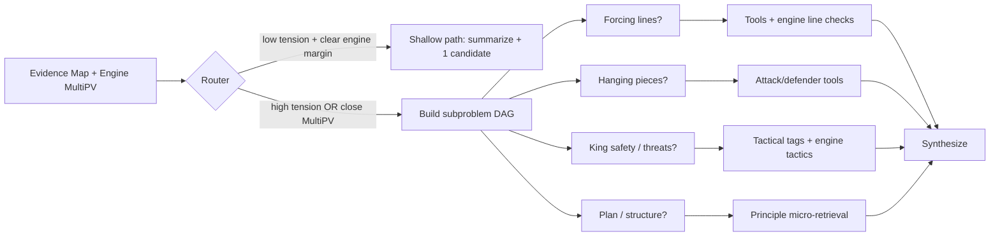

# Zero- and Very-Low-Cost Methods for Specialized-Domain Reasoning Without Retraining  
*(with a focus on chess / xiangqi-style domains, low data, and RAG-light systems)*

## Executive summary

Specialized-domain reasoning failures in LLM-based analyzers (missing key points, misapplying known concepts, brittle chain-of-thought, unreliable reuse of existing knowledge) are often less about “insufficient domain knowledge” and more about **inference-time control**: how the system allocates attention, explores alternatives, verifies claims, and decides when to call tools. Recent research suggests that you can get “specialization-like” gains **without retraining** by combining four levers: **test-time search**, **structured decomposition**, **verification loops**, and **automatic prompt/policy optimization**. citeturn0search0turn0search1turn1search3turn0search2turn0search7

Your current architecture already implements several of the strongest low-cost ideas: a deterministic rules layer producing an **Evidence Map**; strict **tool-call protocols** (e.g., `candidate_id` to prevent illegal-move hallucinations); and multi-expert parallel analysis with claim/evidence weighting. fileciteturn0file0 fileciteturn0file1 fileciteturn0file2  
This is an excellent foundation—meaning the most transformative improvements are likely to come from upgrading **(a)** how agents choose what to investigate and **(b)** how outputs are verified and calibrated, rather than from adding more prompt text.

The most promising “beyond standard CoT” upgrades—ranked by expected impact-to-cost for a chess/xiangqi analyzer with an engine and tactical labels—are:

- **Verifier-guided generation** (CoVe / RARR-like “draft → extract claims → verify → revise”) adapted to *tool-verifiable chess facts* (defenders, legality, tactical tags, engine eval). This directly targets hallucination and “missed key points.” citeturn1search3turn11search0turn1search2  
- **Adaptive decomposition graphs** (Self-Discover + AGoT-style) to replace rigid CoT with a *dynamic DAG of subproblems*, expanding only where uncertainty or “tension” is high. citeturn6search1turn0search33  
- **Search/ensemble at inference** (ToT / GoT / debate / self-consistency) but **scored by your engine and tactical constraints**, not just by the LLM’s self-evaluation. This gives robust tactical coverage with controllable cost. citeturn0search0turn0search1turn4search2turn2search3  
- **Automatic prompt and routing optimization** using small evaluation sets (OPRO, DSPy) where the “reward” is engine-based (e.g., top-1 move match, centipawn loss proxy) and factuality is tool-checked. citeturn0search2turn0search7turn0search3  

## Context, constraints, and your baseline system

### Constraints implied by your request
You want methods that are: (1) **no model retraining**, (2) **low data**, (3) **RAG-light**, (4) **zero/very-low cost**, and (5) tailored to specialized reasoning (e.g., chess / xiangqi). That rules out most domain fine-tuning and heavy retrieval pipelines, but it still leaves a large—and increasingly powerful—family of **test-time** methods (search, decomposition, verification, ensembling, decoding strategies, and prompt/policy optimization). citeturn0search0turn0search2turn1search3turn4search3  

### What you already have (and why it’s a strong starting point)
From your uploaded design docs, your system uses a **deterministic rules engine** to extract facts, then constrains the LLM to “express” those facts via an Evidence Map, avoiding direct board reconstruction by the model, and uses a multi-agent expert setup with structured claims and evidence weighting. fileciteturn0file0 fileciteturn0file2  
You also have: tactical labels, tension signals, a controlled set of tools (including candidate move generation + engine eval), and explicit measures to block hallucinated moves (candidate IDs). fileciteturn0file0 fileciteturn0file1  

This architecture addresses the classic “LLM hallucinates board facts” failure mode, which your docs emphasize as a core issue in chess-style spatial domains. fileciteturn0file0 fileciteturn0file2  
So the remaining failure modes you describe—“too rigid CoT,” “misses key points,” “fails to use known knowledge reliably”—are typically caused by:

- **Attention allocation errors**: the model doesn’t know which facts matter *now* (salience/priority failure).
- **Search failures**: analysis stops at the first plausible line and doesn’t explore alternatives.
- **Verification gaps**: plausible statements sneak in without tool-backed evidence.
- **Policy brittleness**: fixed reasoning templates that don’t adapt to the question, phase, tension, or uncertainty.

These are precisely where recent “test-time reasoning” research clusters.

## Frontier advances in low-data, RAG-light specialization at test time

This section focuses on approaches that *function like specialization*—improving accuracy, coverage, and reliability in a narrow domain—without any weight updates.

### Structured search over reasoning, not just linear CoT
Classic CoT is a single path. Newer methods explicitly treat reasoning as a **search problem**, which is particularly relevant to chess-like domains where exploration and lookahead matter.

Tree of Thoughts (ToT) generalizes CoT by sampling multiple “thoughts,” evaluating them, and exploring a search tree with possible backtracking. citeturn0search0turn0search16  
Graph of Thoughts (GoT) extends this idea to a graph of intermediate “thoughts,” enabling composition, feedback loops, and more flexible control; the paper reports both quality and cost gains on some tasks. citeturn0search1turn0search17  
Separately, “Graph-of-Thought reasoning” work (distinct naming collision) frames non-linear reasoning explicitly as a graph structure, motivating non-sequential exploration. citeturn0search9turn0search13  

**Why this matters for chess/xiangqi**: You already have an engine that can score candidate continuations. That means you can replace ToT/GoT’s often-weak “self-evaluation” with **engine-based evaluation** and prune aggressively. This is a major practicality advantage over many language-only ToT demos.

### Dynamic decomposition that expands only where needed
Two notable 2024–2025 directions directly address your “rigid CoT” complaint:

Self-Discover has the model **select and compose reasoning modules** (e.g., “critical thinking,” “step-by-step,” etc.) into an explicit structure tailored to the task before solving. It reports large improvements on challenging reasoning benchmarks without retraining. citeturn6search1turn6search13  
Adaptive Graph of Thoughts (AGoT, 2025) proposes a **test-time adaptive DAG**: recursively decomposing queries into subproblems and expanding only those that need more analysis, claiming large gains on benchmarks without post-training. citeturn5view0  

**Domain adaptation insight**: In chess-style analysis, the right decomposition depends heavily on phase, tension, and the user’s question (“why is this illegal?” vs. “strategic plan?”). Your tension detector and policy router already approximate this idea; AGoT/Self-Discover suggest pushing it further by making decomposition **explicit, dynamic, and uncertainty-driven**. fileciteturn0file0 citeturn5view0turn6search1  

### Verification loops that reduce hallucination and missed critical checks
Your domain is unusually tool-verifiable: legality, attacks/defenders, tactical tags, and engine eval can be computed. Verification-first paradigms exploit that.

Chain-of-Verification (CoVe) explicitly does: draft → write verification questions → answer them independently → produce a revised final answer, reducing hallucinations across tasks. citeturn1search3turn1search11  
Self-Refine uses iterative self-feedback and refinement loops, improving outputs without training. citeturn1search2turn1search6  
RARR (Researching and Revising) retrofits attribution by extracting claims, retrieving evidence, and revising to fix unsupported statements; it’s explicitly designed to work with minimal training examples and standard retrieval. citeturn11search0turn11search5  

**Chess/xiangqi mapping**: Replace “web retrieval” with “tool retrieval”: for each atomic claim (e.g., “piece X is undefended,” “this move loses material,” “there is a forced line”), automatically generate tool queries (`get_piece_defenders`, `engine_deep_analysis`, `analyze_move`, etc.), then revise. This is essentially CoVe/RARR but with your deterministic toolkit.

### Ensembles and debate as test-time robustness (when scoring exists)
Multiagent Debate shows improved factuality and reasoning by having multiple instances debate over multiple rounds. citeturn4search2turn4search6  
Self-consistency improves CoT by sampling multiple reasoning paths and selecting the most consistent answer. citeturn2search3turn2search7  

In chess-style domains, the key is: **don’t pick winners by LLM rhetoric**. Use your engine and rule-derived constraints to score and select among candidate analyses/moves.

### Inference-time “reasoning MCTS” without retraining
rStar (“Mutual Reasoning…”) is an example of inference-time compute scaling: augmenting Monte Carlo Tree Search (MCTS) with reasoning actions and a discriminator model, reporting improved reasoning without fine-tuning. citeturn4search3turn4search31  
This is frontier because it treats reasoning as a *search/verification game* rather than a single generation.

**Practical adaptation**: you can do a simplified rStar-style loop where:
- the “policy” LM proposes subquestions/tool calls/lines,
- the “discriminator” is replaced or assisted by the engine + tactical-label checker,
- search depth and branching are capped for cost control.

## Prompt engineering variants for specialization with low data and limited RAG

Even though you asked for methods beyond “prompt engineering,” these variants become transformative when combined with **evaluation** and **automatic optimization**.

### Dynamic prompting: prompting as a program, not a string
Plan-and-Solve Prompting separates planning from solving to reduce missing-step errors. citeturn2search2turn2search14  
Least-to-Most Prompting decomposes tasks into simpler subproblems to improve generalization beyond exemplars. citeturn2search0turn2search8  
Step-Back Prompting asks the model to derive abstract principles first, then reason from them; it reports gains on reasoning-heavy tasks. citeturn2search1turn2search5  

**Chess/xiangqi mapping**: Step-back is especially relevant to your “misapplies knowledge” failure. Many chess mistakes are *principle misapplications* (“attack when behind in development,” “trade into losing endgame,” etc.). Step-back prompting can force a “principle selection” step, ideally grounded in your principle snippets retrieved by tension/phase. fileciteturn0file0 citeturn2search1  

### Retrieval-augmented prompting patterns that stay RAG-light
IRCoT (Interleaving Retrieval with CoT) shows that interleaving retrieval with reasoning steps outperforms one-shot retrieve-and-read for multi-step QA, improving both retrieval and downstream accuracy and reducing hallucination. citeturn10view0  

For your constraints, the key is **micro-retrieval**:
- Retrieve only **1–3 “principle cards”** per tension/phase (you already have tension types), not large documents.
- Retrieve **position exemplars** only when the model flags low confidence or ambiguity (triggered retrieval).

This keeps bandwidth small while giving the model the missing “correct frame” for the position.

### Soft prompts and prompt tuning (optional, but worth understanding)
You asked specifically about soft prompts. Soft prompt methods *do* involve optimization, but they keep the base model frozen and update only small prompt parameters:

- Prompt Tuning (soft prompts) learns continuous prompt vectors; the “Power of Scale” paper studies how this becomes competitive at larger scales. citeturn9search0turn9search4  
- Prefix-Tuning learns continuous “prefix” vectors that condition generation while freezing model weights. citeturn9search1turn9search5  
- P-Tuning v2 generalizes prompt tuning across tasks/scales with optimized strategies. citeturn9search2turn9search6turn9search10  

**Pros**: can yield strong specialization with minimal parameters and low labeled data. citeturn9search1turn9search0  
**Cons under your constraint**: still an optimization loop (training-like), and hard to do against closed APIs unless you self-host or use provider-supported adapters.

A very low-cost alternative (no gradients) is **automatic discrete prompt search**:
- AutoPrompt uses gradient-guided trigger token search for masked LMs. citeturn9search3turn9search19  
- OPRO uses an LLM to iteratively propose improved prompts based on measured scores. citeturn0search2turn0search10  

### Prompt optimization frameworks that “compile” robust pipelines
DSPy treats your system as a program of LM calls and can optimize prompts (and sometimes retrieval) against a metric, effectively “compiling” better prompts from small data. citeturn0search7turn0search11turn0search3  
OPRO similarly frames prompt improvement as iterative optimization, using measured task performance as feedback. citeturn0search2turn0search6  

**Why this is a big deal for chess**: you have cheap automatic scoring signals (engine eval, legality checks, label agreement). That means you can run DSPy/OPRO-style optimization with **tens to hundreds** of examples instead of huge datasets, and you can tune not just a single prompt, but the **routing policy** (which agent/tool to call when).

## Multi-agent orchestration and tool integration with tactical labels and Pikafish

### The orchestration frontier: from “multi-agent” to “multi-policy with adjudication”
AutoGen popularized multi-agent conversation patterns with tool use, including programmable interaction behaviors. citeturn4search0turn4search20  
But research and framework docs also caution that many tasks can work with a single agent if the toolset and prompt are right—multi-agent is powerful but not automatically better. citeturn4search13turn4search1  

In chess-style domains, multi-agent becomes transformative when:
- each agent represents a **different analysis policy** (e.g., “tactical forcing line hunter,” “positional evaluator,” “defensive resource finder”),
- and outputs are adjudicated by a **verifier** (engine + tool-backed facts), not by a language-model judge.

Multiagent Debate research supports that multiple agents and multiple rounds can improve reasoning/factuality, but also notes convergence risks when models share misconceptions—so you need interventions/grounding. citeturn4search2turn4search10  

### Tool-use integration details that matter in practice
Because you have a chess engine, you can implement **hard tool grounding**:

- Your engine (Pikafish) is a UCI xiangqi engine; the official repo explicitly positions it as a “free and strong UCI xiangqi engine.” citeturn7search0  
- UCI is commonly used for chess engines; Stockfish docs describe typical UCI command usage and options. citeturn7search1  

**Practical work pattern**: Use your engine primarily for:
1) scoring candidate moves (MultiPV top-n),  
2) generating principal variations (PV lines) as “ground truth trajectories,”  
3) identifying *tactical turning points* via eval swing (blunder detection),  
while the LLM focuses on explaining *why* using tags and verified relations.

### Function calling and structured tools (Chinese-first official docs)
Your current approach is consistent with modern function-calling patterns: the model chooses a tool, your app executes it, then the tool result is fed back for the final response. This is exactly the workflow documented in major Chinese-model ecosystems:

- Qwen function calling documentation (官方文档). citeturn8search0  
- 智谱AI 工具调用（Function Calling）官方文档 (GLM). citeturn8search1  
- DeepSeek Function Calling 官方文档. citeturn8search2  
- 阿里云百炼/Model Studio 的 Function Calling 工作原理与多步交互流程（中文官方文档，更新到 2026-03-17）. citeturn8search4

**Why cite these docs?** Because many reliability gains come from *tool schema design* and *tool-call controls*, not from “better prompting.” The official docs emphasize schema clarity, safe parameterization, and multi-step interactions. citeturn8search1turn8search4  

## Making reasoning flexible and focused

Your described failures (“rigid,” “misses key points”) are classic symptoms of a single linear rationale that cannot (a) explore alternatives reliably or (b) allocate attention adaptively. The following methods are designed specifically to make reasoning both flexible and focused—without drifting into verbose, irrelevant CoT.

### Selective CoT: keep the reasoning power, reduce rigidity and noise
A workable pattern for chess-like analysis is:

- **Hidden work / public summary**: let the model do internal scratch reasoning (or generate intermediate structures), but only **emit a short “Reasoning Outline”** + tool-cited claims to users.  
- **Checklist gating**: require coverage of specific “must-check” items depending on tensions/labels (e.g., checks, hanging pieces, pins/skewers, tactical threats). This is a *policy constraint* more than a prompt trick.

This idea is aligned with Plan-and-Solve (explicit planning reduces missing steps). citeturn2search2turn2search14  

### Modular chains and latent-variable prompts
Self-Discover formalizes a version of “latent variable prompting”: the model first composes a reasoning structure from atomic modules, then executes it. citeturn6search1turn6search13  
For chess, you can define your own domain modules, such as:

- Forcing lines (checks/captures/threats)
- King safety / general safety
- Material balance and hanging pieces
- Piece activity and coordination
- Engine disagreement analysis (when MultiPV lines are close)
- Defensive resources and counterplay

Then the “latent variable” is a selected subset of modules plus their order.

### Uncertainty-aware prompting and calibration using ensembles and tools
Self-consistency naturally provides a confidence proxy: proportion of samples agreeing on an answer. citeturn2search3turn2search7  
SelfCheckGPT similarly uses sampling diversity/contradiction as a hallucination signal for black-box LMs. citeturn3search1turn3search17  

For chess, you have even better calibration signals than text-only tasks:

- **Engine margin**: if top-1 vs top-2 eval is tiny, the situation is ambiguous—trigger deeper search or more tool calls.
- **Tension level**: your tension detector already identifies “high-stakes” or contradictory situations; use it to trigger stronger verification, not just different experts. fileciteturn0file0  

### Decoding strategies that improve factuality/reasoning (mainly for self-hosted/open models)
If you run open-weight LLMs, there are training-free decoding methods:

- Contrastive Decoding improves reasoning performance by contrasting strong vs weak models (or expert vs amateur) during generation. citeturn3search3turn3search11  
- DoLa reduces hallucinations by contrasting logits from different transformer layers—no external knowledge and no fine-tuning, but requires access to internal layers. citeturn3search0turn3search12  

These are not typically available through closed APIs, but can be powerful if you self-host.

### Latency/cost control: Skeleton-of-Thought and parallel fills
Skeleton-of-Thought generates a skeleton first, then fills sections in parallel, improving speed and sometimes quality. citeturn6search2turn6search14  
For your system, this maps naturally to:
- create an outline: (Evaluation, Tactical threats, Candidate moves, Plans, Risks)
- fill each section in parallel (or with separate tools) **only when needed**.

## Evaluation metrics and experimental design for chess/xiangqi specialization

Your domain is unusually amenable to rigorous evaluation because you have:
- deterministic labels/features (Evidence Map / tactical tags), fileciteturn0file0  
- and an engine oracle (Pikafish). citeturn7search0turn7search1  

### Metrics you can compute cheaply and automatically

| Metric family | What it measures | How to compute in your environment | Why it catches your failure modes |
|---|---|---|---|
| Move-quality agreement | Whether “recommended move” is actually strong | Top-1 / Top-3 agreement vs engine MultiPV; or eval of recommended move vs best move | Catches “confident but wrong” move suggestions |
| Regret / centipawn-style loss proxy | How costly the recommendation is | `engine_eval(best) - engine_eval(chosen)` | Allows continuous scoring, not just accuracy |
| Factuality / faithfulness | Hallucinations about board facts | % of atomic claims supported by tool outputs (defenders, attacks, legality) | Directly targets hallucination and misapplied relations |
| Label coverage | Missed key tactical points | Compare mentioned motifs vs detected tactical labels; compute recall/precision over label mentions | Targets “misses key points” |
| Tool discipline | Whether the system uses knowledge reliably | Rate of “claim requires tool” compliance; number of tool calls; invalid tool args | Reveals when the model is guessing instead of checking |
| Calibration | Whether the system flags uncertainty appropriately | Correlate “confidence” (self-consistency / engine margin) with outcome quality | Avoids overconfident wrong explanations |

### Experimental designs that isolate causality (what changed what)

Ablation is essential because most methods interact.

A recommended “minimum viable” experimental matrix:

| Experiment | Baseline | Treatment | Dataset size | Primary outcome | Cost note |
|---|---|---|---:|---|---|
| Verification loop | Current pipeline | Add CoVe-style claim verification + revision | 200–1,000 positions/questions | Faithfulness ↑, hallucination ↓, label coverage ↑ | Adds 1–2 short LLM calls + some tool calls |
| Adaptive decomposition | Current fixed expert prompts | Self-Discover/AGoT-style dynamic subproblem DAG | 200–500 mixed queries | Fewer missed key points; better focus; fewer irrelevant tokens | More orchestration logic; can reduce wasted tokens |
| Ensemble with engine adjudication | Single analysis | N analyses (N=3–5), pick via engine score + factuality | 100–300 tactical positions | Move-quality ↑ and robustness ↑ | Linear LLM cost in N, but can cap with early stopping |
| Prompt/policy optimization | Handcrafted prompts | OPRO or DSPy optimize prompts/routing on small train set | 50–200 training examples; 200 eval | Global reliability ↑ with minimal human iteration | Run offline, not per request; can be extremely cheap if capped |

### A “budget-aware” stopping rule (high ROI in practice)
Almost all test-time methods become affordable if you add **early stopping** rules driven by:

- engine margin (“clear best move” vs “close calls”),  
- tension threshold,  
- tool-verified contradiction detection (if agents disagree on tool-backed facts, escalate).

This keeps heavy reasoning only where necessary—an AGoT-like principle. citeturn5view0  

## Concrete low-cost prototypes and step-by-step implementation plans

Below are designs intended to be implementable *within your existing Evidence Map + multi-agent + tool suite*, and to directly attack your current pain points.

### Prototype A: Tool-backed Chain-of-Verification for chess analysis (highest priority)

**Goal**: eliminate “plausible but wrong” claims and force missing critical checks to surface.

**Core idea**: Adapt CoVe to your tool environment: draft → extract atomic claims → generate verification queries → call tools → revise. citeturn1search3turn1search11  

**Workflow (mermaid)**

```mermaid
flowchart TD
  U[User question + FEN] --> F[Rules/Engine precompute -> Evidence Map]
  F --> D[Draft explanation (LLM)]
  D --> C[Extract atomic claims (LLM or parser)]
  C --> V[Plan verification actions (LLM)]
  V --> T[Execute tools: defenders/attacks/legality/engine lines]
  T --> R[Revise explanation using verified results (LLM)]
  R --> O[Final answer with evidence pointers + uncertainty]
```

**Step-by-step**
1. **Define “atomic claim types”** relevant to chess/xiangqi explanation: legality, attacks/defenders, engine eval deltas, tactical motifs, “best move is X,” “piece is hanging,” “forced sequence exists,” etc.
2. Implement a **claim extractor**: either a small parser over structured output (JSON schema), or an LLM that emits a list of claims with typed fields.
3. Map each claim type to **mandatory verification tools** (your system already does this for some relations; extend it systematically). fileciteturn0file0  
4. Execute planned tool calls; store results as a verification table.
5. Run a short “revision” call that must:
   - delete/refute unsupported claims,
   - replace them with tool-backed statements,
   - add any missing “must-check” sections triggered by tensions/tags.
6. Add a **stop condition**: if all high-risk claim types are tool-verified and no contradictions remain, skip extra loops.

**Expected costs**
- Typically +1 LLM call for claim extraction and +1 for revision (can merge if needed), plus some targeted tool calls. Compared to re-running full experts, this tends to be cheap—and often reduces total failures more than adding more CoT.

**Main risk**
- If claim extraction is too coarse, you’ll miss verifying exactly the statements that matter. Mitigation: use typed claim schemas and “must-include claim list” derived from tension/tag signals.

### Prototype B: Adaptive decomposition graph driven by tension and uncertainty

**Goal**: replace rigid CoT with dynamic expansion: analyze only where needed.

**Core idea**: Implement an AGoT/Self-Discover hybrid: build a DAG of subquestions; expand nodes only when uncertain, contradictory, or high-tension. citeturn5view0turn6search1  

**Workflow (mermaid)**



**Step-by-step**
1. Define 6–10 **node templates** (subproblem types) with:
   - trigger conditions (tags/tension/engine margin/question type),
   - required tools,
   - expected outputs (structured).
2. Implement a small controller (could be deterministic first):
   - choose initial nodes (coarse),
   - expand nodes when outputs show contradiction/uncertainty.
3. Optionally add a Self-Discover-style “module selection” call: the LLM chooses which nodes to instantiate, constrained to your template list. citeturn6search1turn6search13  
4. Synthesize with strict rules: prefer tool-backed statements; include uncertainty when the engine margin is small.

**Expected costs**
- Often *cheaper than always running all experts*: many positions are low tension and can be answered shallowly; hard positions expand selectively.

**Main risk**
- Controller complexity and debugging. Mitigation: start with deterministic triggers (tension + margin), log everything, then optionally optimize later with DSPy/OPRO.

### Prototype C: Engine-scored ToT/ensemble for “missed tactics” robustness

**Goal**: reduce “missed key tactical point” by forcing exploration of alternatives.

**Core idea**: Use ToT-like branching or multi-agent debate/self-consistency, but score candidate analyses by:
- engine eval of recommended moves/lines,
- tactical-label consistency,
- factuality (tool verification). citeturn0search0turn4search2turn2search3  

**Implementation steps**
1. Generate N candidate analyses (N=3–5). Each must output:
   - recommended move(s) by candidate_id,
   - key tactical motifs claimed (from a closed vocabulary aligned with your labels),
   - “critical line” (PV-like) in structured format.
2. Score each candidate:
   - **engine regret**: best_eval − eval(candidate_move),
   - **label alignment**: how many claimed motifs match detected labels,
   - **factuality**: % of tool-verifiable claims that pass.
3. Select top candidate or merge top-2 if complementary.
4. Run a short final “coach explanation” generation step.

**Expected costs**
- Linear in N LLM calls, but can be bounded with early stopping: if first candidate is strong and verified, stop.

**Main risk**
- Ensembling can converge to a shared misconception (debate studies discuss this). Mitigation: enforce diverse roles/policies and rely on engine/tool scoring to break ties. citeturn4search10turn4search2  

### Prototype D: Automatic prompt + routing optimization with small data (offline)

**Goal**: stop hand-tuning prompts that are either “too rigid” or “too loose.”

**Core idea**: Use OPRO or DSPy to optimize:
- system prompts,
- per-role instructions,
- routing thresholds,
- verification triggers,
against your evaluation harness. citeturn0search2turn0search7turn0search3  

**Step-by-step**
1. Build an evaluation set of 200–500 examples: `(FEN, question, expected signals)` where expected signals can be:
   - engine best move/top-3,
   - key tactical labels,
   - legality checks,
   - optionally human preference ratings (small, 20–50 examples).
2. Define an objective function:
   - `score = w1*topk_accuracy - w2*regret - w3*hallucination_rate + w4*label_recall - w5*token_cost`
3. Run prompt optimization:
   - OPRO: iterative “propose new prompt variants → evaluate → keep best.” citeturn0search2turn0search10  
   - DSPy: define your pipeline as modules and let DSPy compile prompts against the metric. citeturn0search7turn0search11  
4. Lock the best prompt/policy versions and deploy.

**Expected costs**
- This is an *offline cost*; online inference can become cheaper because prompts become shorter and routing becomes smarter.

**Main risk**
- Overfitting to your eval set. Mitigation: keep a holdout set and include diverse position types (openings/tactics/endgames).

## Prioritized bibliography and experiment shortlist

### Primary sources most directly relevant to your constraints

Inference-time search & adaptive reasoning (high priority)
- Tree of Thoughts (ToT). citeturn0search0turn0search16  
- Graph of Thoughts (GoT, ETH Zurich). citeturn0search1turn0search17  
- Adaptive Graph of Thoughts (AGoT, 2025). citeturn5view0  
- Self-Discover (NeurIPS 2024). citeturn6search1turn6search13  
- rStar / Mutual Reasoning (ICLR 2025 track; arXiv 2024). citeturn4search3turn4search31  

Verification & hallucination reduction (high priority)
- Chain-of-Verification (CoVe). citeturn1search3turn1search11  
- Self-Refine. citeturn1search2turn1search6  
- RARR (Research & Revision with attribution). citeturn11search0turn11search5  
- SelfCheckGPT (zero-resource hallucination detection). citeturn3search1turn3search17  

Prompt optimization / compilation (high priority)
- OPRO (LLMs as optimizers). citeturn0search2turn0search6  
- DSPy paper + framework. citeturn0search7turn0search3turn0search11  

Multi-agent (useful when grounded/scored)
- Multiagent Debate. citeturn4search2turn4search6  
- AutoGen (framework + paper). citeturn4search0turn4search20  

RAG-light retrieval interleaving
- IRCoT (Interleaving Retrieval with CoT). citeturn10view0  

Decoding-only methods (mostly for open models)
- Contrastive Decoding for reasoning. citeturn3search3turn3search11  
- DoLa for factuality. citeturn3search0turn3search12  

### Chinese-language official docs for tool calling (relevant to your tool-heavy system)
- 智谱AI 工具调用（Function Calling）官方文档. citeturn8search1  
- DeepSeek Function Calling 官方文档（中文）. citeturn8search2  
- 阿里云百炼 / Model Studio Function Calling（中文官方文档，2026 更新）. citeturn8search4  
- Qwen Function Calling docs. citeturn8search0  

### Engine and protocol references for reproducible evaluation
- Official Pikafish repo (UCI xiangqi engine). citeturn7search0  
- Stockfish UCI commands (useful as canonical UCI reference). citeturn7search1  

### Suggested experiment shortlist (fastest path to “transformative” gains)

1. **Add Prototype A (tool-backed CoVe) to your existing pipeline** and measure:
   - hallucination rate,
   - label recall,
   - engine regret on recommended moves,
   - cost per query.
   Expectation: largest immediate improvement in trust and consistency. citeturn1search3turn1search11  

2. **Swap your fixed expert reasoning templates for Self-Discover-style module selection** constrained to your domain modules.
   Expectation: fewer rigid/misaligned analyses; better coverage in unusual positions. citeturn6search1turn6search13  

3. **Ensemble N=3 analyses, adjudicate with engine+tools** for tactical-high-tension positions only.
   Expectation: reduces “missed tactic” errors with bounded cost. citeturn4search2turn2search3  

4. **Offline OPRO/DSPy optimization** of prompts + routing thresholds using a 200–500 example harness.
   Expectation: reduced prompt brittleness and lower online token cost via better routing. citeturn0search2turn0search7  

5. If you self-host open models: test **Contrastive Decoding / DoLa** on your explanation generation subtask.
   Expectation: improved factuality/consistency in text generation without retraining (but requires model internals). citeturn3search3turn3search0